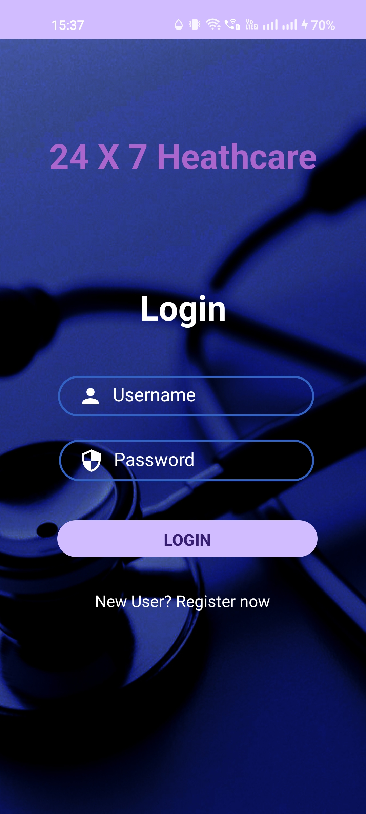

<h1>24X7 HealthCare App</h1>
<h2>This is an Android Development Project made using Java and MySQLite Database.</h2>
<h2>It is a platform where users can perform the following: </h2>
<h3>1. Register and Login</h3>
<h3>2. Find Doctors</h3>
<h3>3. Book Appointments</h3>
<h3>4. Book Lab Tests</h3>
<h3>5. Buy Medicines</h3>
<h3>6. Refer to Health Articles</h3>
<h4>7. Here are some pictures of how this app looks: </h4>

    
    
    

    
    
    

    
    
    

